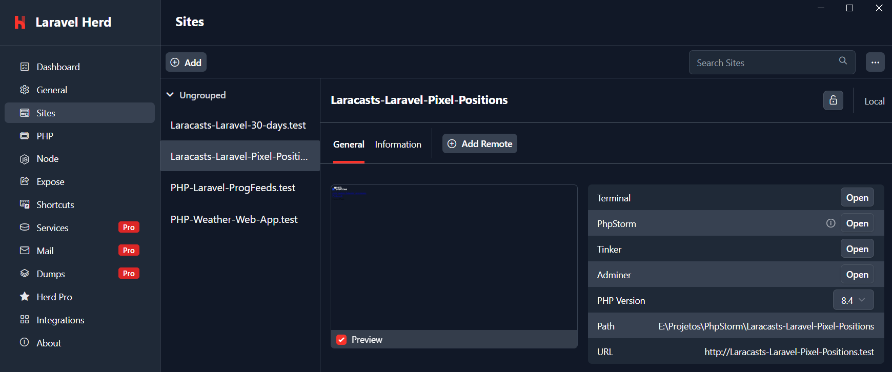
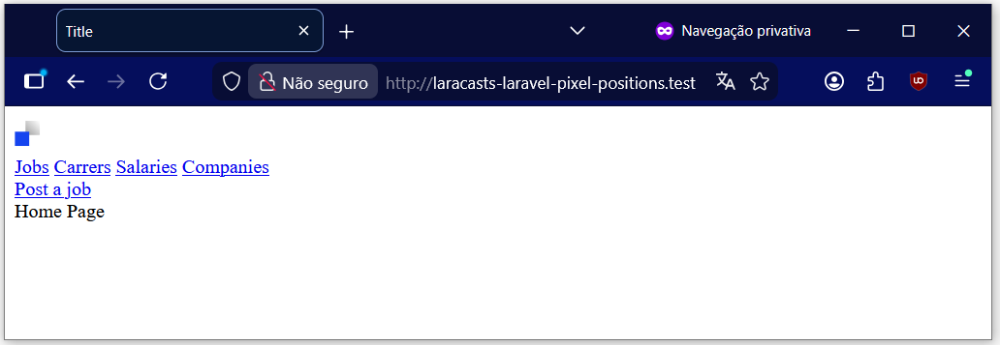

# Pixel Positions
Final project for the **30 Days to Learn Laravel** course from **Laracast**.


## Development

### Front-end

- I created a subdirectory called `images` in `resources`;
- I downloaded the file [logo.svg](https://github.com/laracasts/pixel-position/blob/main/resources/images/logo.svg)
  and placed it in `resources/images`;
- In `resources/js/app.js` I added a reference to the images directory:
```javascript
// app.js
import './bootstrap';
import.meta.glob(['../images/**']);
```

- In the terminal, I ran the command `npm run build` to generate the `build` folder (and its files) inside `public`.
- I created the `components` directory in `resources/views`.
- In `resources/views/components`, I created the file `layout.blade.php`.
- In `resources/views`, I created the file `home.blade.php` with `<x-layout>Home Page</x-layout>`.
- In `routes/web.php`:
  * I changed the route of the `welcome` page to `/welcome`;
  * I added the route of the `home` page to `/`.
- I accessed the application's home page using the URL provided by Laravel Herd.
  `http://laracasts-laravel-pixel-positions.test/`.





- I checked if the Tailwind is installed correctly.
  [guide](https://tailwindcss.com/docs/installation/framework-guides/laravel/vite):
  * In `vite.config.js` you must have `tailwindcss` imported at the beginning and called in plugins:
```javascript
// ...
import tailwindcss from '@tailwindcss/vite';
export default defineConfig({
    plugins: [
        // ...
        tailwindcss(),
    ],
});
```
  * In `resources/css/app.css` there must be `@import 'tailwindcss';`.
  * In `layout.blade.php` there must be `@vite('resources/css/app.css')` or
  `@vite(['resources/js/app.js', 'resources/css/app.css'])`.

- I created the `tailwind.config.css` file:
```javascript
module.exports = {
    content: ['./resources/**/*.blade.php', './resources/**/*.js'],
    theme: {
        extend: {},
    },
    plugins: [],
}
```


### Back-end
- In `database/migrations`, I changed `0001_01_01_000002_create_jobs_table.php`:
  * renamed the file to `0001_01_01_000002_create_queued_jobs_table.php`
  * renamed the table names:
  * `jobs` to `queued_jobs`;
  * `job_batches` to `queued_job_batches`;
  * `failed_jobs` to `queued_failed_jobs`.


## References
Laracast - 30 Days to Learn Laravel
https://laracasts.com/series/30-days-to-learn-laravel-11

Laracast - From Design to Blade
https://laracasts.com/series/30-days-to-learn-laravel-11/episodes/27

Laracast - Blade and Tailwind Techniques for Your Laravel Views
https://laracasts.com/series/30-days-to-learn-laravel-11/episodes/28

Laracast - Jobs, Tags, TDD, Oh My!
https://laracasts.com/series/30-days-to-learn-laravel-11/episodes/29

Laracast - The Everything Episode
https://laracasts.com/series/30-days-to-learn-laravel-11/episodes/30

Tailwind - Docs - Installation - Framework guides - Laravel
https://tailwindcss.com/docs/installation/framework-guides/laravel/vite
